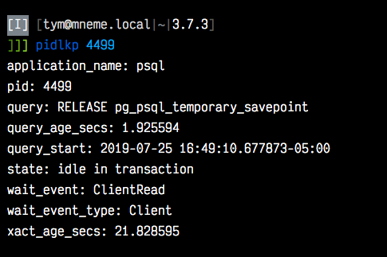

# Lookup activity stats by pid in Postgres

## Install

```sh
git clone https://github.com/tym-xqo/pid-lookup.git; cd pid-lookup
pipenv install
mv .env.example .env
ln -s ./pid_lookup.py /usr/local/bin/pidlkp
```

## Configure

Edit `.env` to suit your case
As database superuser, run [`schema.sql`](schema.sql) against your `$DATABASE_URL` database, if needed. (The DDL is idempotent; it won't hurt anything if run more than once, but isn't necessary to repeat.)

## Use

```sh
pidlkp <pid>
```

Output will look something like this contrived example


